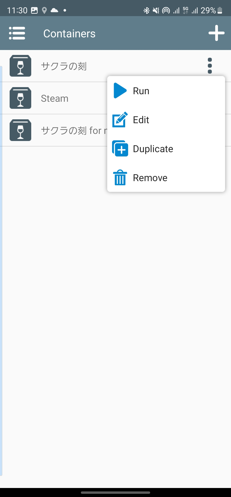

## 背景
**買ったギャルゲーが消化しきれない!!**
 
...皆さん、このような悩みは誰しも1度や2度、   
100度ほど思ったことがあるのではないでしょうか？   
私は日頃思ってます (煩悩おい
 
**そんなみなさんに朗報です！今回はそのソリューションを提案します！！**   
**これで世界平和です!(*^_^*)**

## Winlatorのご紹介
### Winlatorとは
[Winlator](https://github.com/brunodev85/winlator)とは、Android(Arm64でも可)上で、   
Wine環境をコンテナ化してくれる**神アプリ**である。  
**HWアクセラレーションもある程度効くし、ネットワーク通信も、音声も出力される。**
### Wineとは
Wineとは、WindowsアプリケーションをUnix/Linux系のOS上で動かせるようにするプログラムである。   
Wineはエミュレーターではなく、Windows APIを変換して動かす方式で、Mac OSやLinux、Androidで動作させることが出来る。
**簡単に言えばWineは、Linux上でWindowsを動作させているのではなく、LinuxにWindowsと同じ挙動をさせているのである。**(Wikipedia引用)
→つまり、CPUエミュレーションを行っていないため、Windowsエミュレータに比べパフォーマンスの劣化が少ないことが特徴。

## 動作確認環境
- Galaxy S23 Ultra (docomo) 512GB
    - CPU SoC: Snapdragon® 8 Gen 2 Mobile Platform for Galaxy
    - RAM 12GB & 仮想RAM8GB
    - One UI 5.1
    - Android 13
    - ルート化はしていません。

## Winlatorの導入(2023-08-19現在)
1. [WinlatorのAPK](https://github.com/brunodev85/winlator/releases)をスマホでダウンロードする。
2. [main.1.com.winlator.obb](https://github.com/brunodev85/winlator/releases/tag/v1.0.0)をスマホでダウンロードする。
3. WinlatorのAPKをインストールする。
4. 初回起動時にmain.1.com.winlator.obbの場所を聞かれるので、指定する。

## サクラの刻、やってみた！
発売日に買ったくせに全然進めれてないサクラの刻を捗らせてみようと思います    
このゲーム、ほとんどエッチシーンが無いので、内容的には割とどこでも出来ちゃうんですよね〜   
### 事前準備
1. 適当な手段で、スマホのDownloadフォルダーにサクラの刻のアプリケーションを入れる
2. (できれば)OPムービー以降のセーブデータもスマホのDownloadフォルダーに入れとく
    - 理由は後述
### Winlatorの設定
1. 画面右上のの「＋」を押して、コンテナを作成する

2. 作成したコンテナの「︙」をタップし、Editをタップする

3. 以下のように設定する

4. 作成したコンテナの「︙」をタップし、Runをタップする

5. サクラの刻のセーブデータをDドライブからCドライブに移行しておく
    - **このDドライブは。スマホのDownloadフォルダーがマッピングされている（超便利）**
    - 詳細は割愛(ざっくりいうと、ユーザーの中のAppDataのRoamingにある)
    - **日本語は文字化けしているが気にせず頑張る**
5. エクスプローラーが開くので、Dドライブ→サクラの刻のexeを開く
    - このとき、インストーラーではなく、直接ゲームのexeを起動すること(インストーラーは多分起動しない？)
6. **Enjoy!**
    - 当方の環境では、平均50FPSぐらいで安定。
    - 音声は、DX ComponentsをすべてNativeにすることで音切れなく安定
        - Builtinにすると、時々ポツポツ音切れが見られる

## 現状、yukimakuraが直面してる問題
### OPムービーで死ぬ
これは、なかなか難しい問題です...    
多分、Winlatorの問題ではなくWineの問題かと思われ...    
実は、macOSのWineにて以前Wine上でサクラの刻やってたのですが、   
**ここでも、ムービーに切り替わると死んでました...**   
まぁ、しゃーなしで、OPムービーを超えたセーブデータを読み込むしか無いですね...    
↓途中まで再生できるが、毎回ここで死ぬ   
   
↓以下、ムービーを途中まで再生できた設定   
   
   
   
   
   

### アプリを一瞬でもバックグラウンドにすると、マウスカーソルが死ぬ(クリックできなくなる)
これ、結構困ってます。   
現状だと、うっかりブラウザや他のチャットアプリなど切り替えると、   
**クリックが効かなくなる**んですよね...   
これ私だけ？？🤔

### (おまけ)Steamはインストール出来たけど、肝心のSteam自体が激重
ついでに、NeedyGirl Overdoseもスマホで出来たらな。と思って、   
挑戦してみたのですが、**Steamが重すぎてコンテンツのインストールが大変でした。**   
スマホでいつでも超絶最かわ天使ちゃんを拝みたいので、もう少し粘ります。     
続報あったら、追記か新しく記事起こすかも。   

## 〆
**まぁぁぁぁぁじで感動した**   
これ、ガチで長年の夢だったんですよね。   
それこそ、6年越しレベル。   
昔、AsusがZenfone2というスマホを販売していて、自分がそれだったのですが、   
そいつは当時珍しくRAM4GB積んでいて、かつAtom搭載だったんです。   
正直爆熱だわ、電池持ちクソ悪いわでいい印象がほぼなかったスマホでしたが、   
唯一Atomということで、Winアプリを動かせれるんじゃないかと期待させられました。   
一応、CrossOverというアプリが自分が求めるものに近かったのですが、   
さすがAtom、実用皆無でした..._(:3」∠)_   
**それが！！！いよいよ！！！！スナドラのAndroidで動くわけです！！！！**
**全俺が泣いた(´；ω；｀)ｳｯ…**   
~~Windows11(aarch64版)のx64エミュレーションなんて要らんかったんや~~   
では(^^)ノシ
