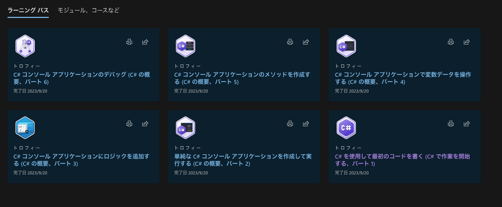
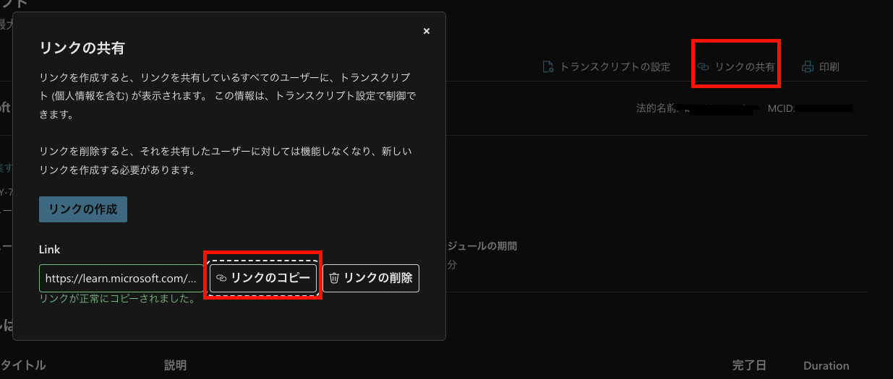
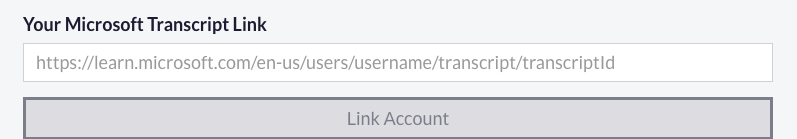
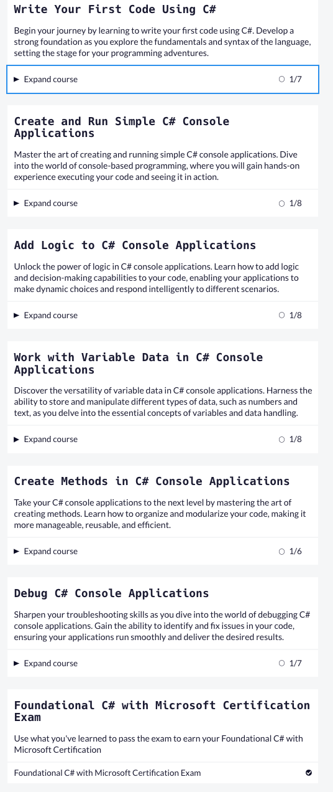
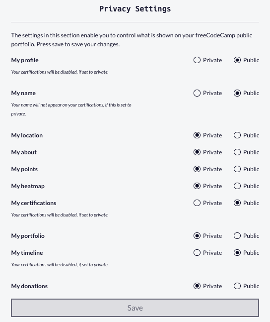
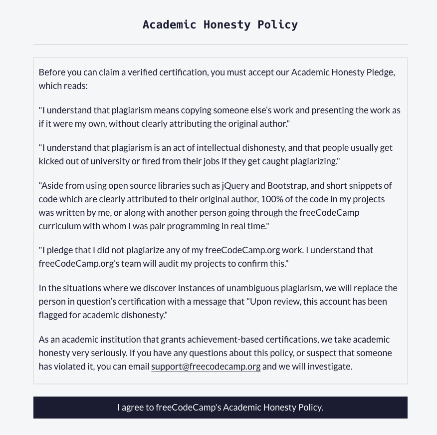
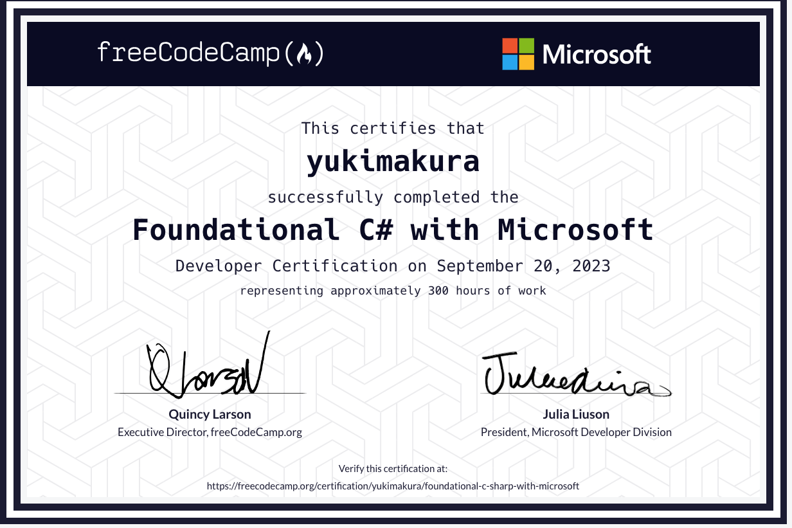

## 背景
Javaとかは認定資格とかが結構いろいろあるが、   
C#は全くと言っていいほどそういうものがなかった。   
(厳密には2022年あたりまであったのだが廃止となった)   
それが！急に2023年8月末にMSがfreeCodeCampとコラボと言う形で   
`Foundational C# Certification`という資格を打ち出した！   
しかも無料！   
...てなわけでやってみた！

## MSLearnに登録し、6つのラーニングパスをすべてクリアする
[ここに公式のラーニングパスのまとめがあるので、全てクリアする](https://learn.microsoft.com/ja-jp/users/dotnet/collections/yz26f8y64n7k07)   
- これがなかなかのボリューム。公式曰く30時間分ほどらしい

## 6つのトロフィーが取得されているか確認する
[トロフィー一覧を確認する](https://learn.microsoft.com/ja-jp/users/me/achievements#trophies-section)   
6つあればOK！


## freeCodeCampにログインし、それぞれのトロフィーと連携する
1. [MSLearnのトランスクリプトを開く](https://learn.microsoft.com/ja-jp/users/me/transcript)
2. `リンクの共有`→`リンクの生成`→`リンクのコピー`をクリックする   
   

3. [freeCodeCampのC＃のページに飛び、ログインする](https://www.freecodecamp.org/learn/foundational-c-sharp-with-microsoft/)
4. `Courses`のそれぞれ最後に`Trophy - コースの名前`があるのでそれをクリックする
5. `Your Microsoft Transcript Link`に先程コピーしたURLを貼り付け、`Link Account`をクリックする
   

6. `Verify Trophy`をクリックする   

7. 残りのコースの項目もVerifyする
  - これ、実はミソで**TrophyさえすべてVerifyできれば試験を受けれる**


## お受験する！
あとは残された`Foundational C# with Microsoft Certification Exam`をクリアするのみ！
- 問題数は80問
- 英語（ブラウザの翻訳機能をつかえばOK）
- 制限時間はなし(ただし計測はされる)
- 70%以上解ければ合格

ちなみにゆきまくらは
```
Foundational C# with Microsoft Certification 
Exam: Passed 
Number of questions: 80 Correct answers: 72
Percent correct: 90% 
Time: 32:02
```
であった

## 証明書を発行する
1. [freeCodeCampのSettingsに飛ぶ](https://www.freecodecamp.org/settings)
2. `Username`、`Name`を設定する（Saveを忘れずに）
3. `Privacy Settings`にて、`My profile`、`My name`、`My certifications`、`My timeline`を`Public`に変更する(Saveを忘れずに)

4. `Academic Honesty Policy`に同意する
  - `I agree to freeCodeCamp's Academic Honestry Policy.`をクリック

5. スクロールし、`Foundational C# with Microsoft`の`Claim Certification`をクリックする

**以上！お疲れ様でした(*^^*)**



[ゆきまくらの証明証書](https://www.freecodecamp.org/certification/yukimakura/foundational-c-sharp-with-microsoft)

## 〆
ネットのニュース記事にて見つけて、早速飛び乗ってみました！    
MSLearnをまともに使ったことなく、当初勘違いでfreeCodeCampにてトロフィーを発行するものだと思っていました。(ちゃんと読めって話ですよね...)      
もちろん、日本語の紹介ブログや記事もないわけで最初戸惑いましたがなんとかクリアできました！ヤッタネ👍    
自称最速日本語紹介記事になったと思います。ええ。    

当方はある程度C#触れるので今回はめちゃくちゃ飛ばしながらやりましたが、    
(約1.5hぐらいで取得できました)   
学習コンテンツとしてはとても良質だと思います。   
それこそ、企業でも新卒の教育コンテンツとしても使ってもよし、趣味でやってもよしと活用の幅は広いと思います。   
**しかも無料ネ！(激アツ)**   
ありがとうございます...MS様...

そして今回改めてMSLearnの優秀さに気づけれました！   
Azureの勉強とかもMSLearnでガンガン勧めていこうかと。

では今日はこんなところで！   
では(^^)ノシ