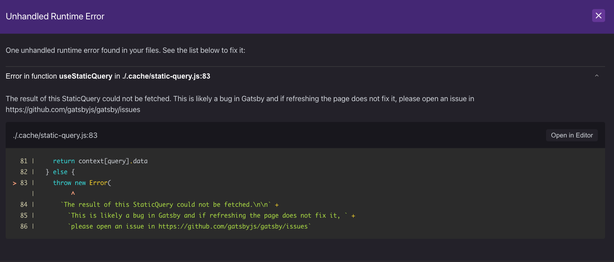

## 経緯
サイドバーにタグ一覧コンポーネントや月別アーカイブコンポーネントを作成していると、発生した。   
なかなかググっても解決策は出てこず...   
```
Unhandled Runtime Error
Close
One unhandled runtime error found in your files. See the list below to fix it:


Error in function useStaticQuery in ./.cache/static-query.js:83
The result of this StaticQuery could not be fetched. This is likely a bug in Gatsby and if refreshing the page does not fix it, please open an issue in https://github.com/gatsbyjs/gatsby/issues

./.cache/static-query.js:83
Open in Editor
  81 |     return context[query].data
  82 |   } else {
> 83 |     throw new Error(
     |          ^
  84 |       `The result of this StaticQuery could not be fetched.\n\n` +
  85 |         `This is likely a bug in Gatsby and if refreshing the page does not fix it, ` +
  86 |         `please open an issue in https://github.com/gatsbyjs/gatsby/issues`
```


## 解決策(あくまで自分の環境での話)
基本、GraphiQLでクエリを作成・確認をしてからそれを脳死コピペで使っていたのが原因だった。    
   
みんなquery名が `MyQuery`となってしまっており、    
どうやら基本的にはクエリ名の競合はNGなようだ。   
クエリ名をみんなバラバラにしたところ、   
エラーが出なくなった。   

## 〆
<h3>圧倒的初見殺しッッッ！</h3>   
皆さんもお気をつけて。   
(^^)ノシ