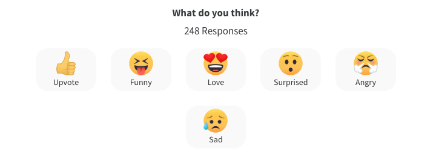

Gatsbyは静的サイトなわけで、   
当然コメントなどの動的コンテンツを扱えない。   
今回はDisqusというサービスを導入して、ブログにコメント欄をお手軽に導入する話。

## Disqusに登録する
1. [この画面でアカウント登録する](https://disqus.com/profile/login/?next=/profile/signup/intent/)
2. コメントを追加するブログの情報を入力する


## 自分のサイトにコーディングしていく
3. disqusのプラグインを導入する
``` shell:title=shell
npm install --save gatsby-plugin-disqus
```
4. 様々なフレームワークから選択を迫られるので、`Gatsby`を選択し、   
下図の赤枠で囲った領域を`gatsby-config.js`に追記しとく

5. 自分のサイトの埋め込みたい箇所にDisqusを埋め込む
``` jsx{3,10-14,17}:title=example.js
import { graphql, useStaticQuery } from "gatsby"
import React from 'react'
import { Disqus } from 'gatsby-plugin-disqus'

const Hoge = = ({
  data: { previous, next, site, markdownRemark: post },
  location,
}) => {

    let disqusConfig = {
        url: `${encodeURI(site.siteMetadata?.siteUrl + post.fields?.slug)}`,
        identifier: post.id,
        title: siteTitle,
    }
    return (
        <div >
            <Disqus config={disqusConfig} />
        </div>
    )
}

export const pageQuery = graphql`
  query BlogPostBySlug(
    $id: String!
    $previousPostId: String
    $nextPostId: String
  ) {
    site {
      siteMetadata {
        title
        siteUrl
      }
    }
    markdownRemark(id: { eq: $id }) {
      id
      excerpt(pruneLength: 160)
      html
      frontmatter {
        title
        date(formatString: "MMMM DD, YYYY")
        description
      }
      fields{
        slug
      }
      tableOfContents
      timeToRead
    }
    previous: markdownRemark(id: { eq: $previousPostId }) {
      fields {
        slug
      }
      frontmatter {
        title
      }
    }
    next: markdownRemark(id: { eq: $nextPostId }) {
      fields {
        slug
      }
      frontmatter {
        title
      }
    }
  }
`


```

## (オプション)アクションボタンを消す
デフォルトだと、以下のようなアクションボタンが付いてくる   

自分は不要と感じたので無効化する。
6. disqusの管理サイトに飛び、対象のサイトを選択し、`Settings`タブ→`Reactions`→`Turn Reactions off`をクリックする


すると、サイトの方でリアクションが消える

以上。

## 〆
当初は勉強がてらにコメントシステムも実装してみようかな〜とか思ったんです。   
(1インスタンスだけへちょいConohaのVPSを契約してるのでそいつを使おうかと)   
けど、スパム対策とか、セキュリティとかいろいろ考えるとめんどくさくなってきた（おい）ので、   
既存のサービスをマッシュアップしようとしたわけです。

どうやら、広告もついてきてしまうようですが、    
まぁサービスの運営維持費を考えれば当然のことですよね...   
なので、自分的には受け入れようと思います。
では。(^^)ノシ
