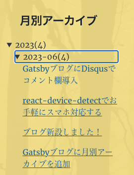
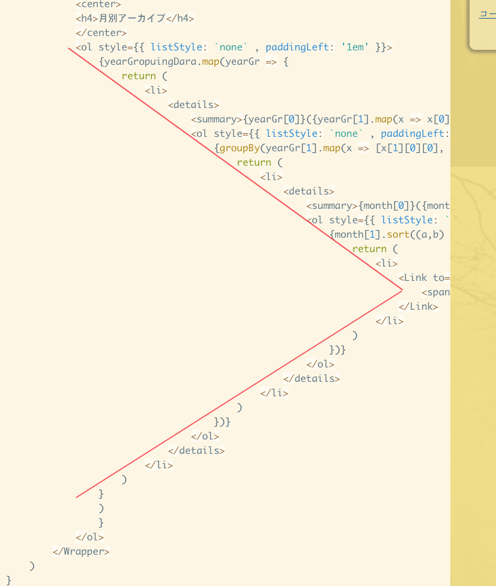

## 前提条件
GraphQLのスキーマとして、[gatsby-starter-blog](https://www.gatsbyjs.com/starters/gatsbyjs/gatsby-starter-blog)をベースとする

## コード
### コンポーネント作成
`src/components`下に`monthlyarchives.js`を作成し、以下コピペ
``` js:title=monthlyarchives.js
import { graphql, useStaticQuery, Link } from "gatsby"
import React from 'react'
import styled from '@emotion/styled'
import { Timeline } from 'react-twitter-widgets'
import { typography } from "@chakra-ui/react"

const MonthlyArchives = () => {

    const Wrapper = styled.div`
  `

    const groupBy = (array, getKey) =>
        Array.from(
            array.reduce((map, cur, idx, src) => {
                const key = getKey(cur, idx, src);
                const list = map.get(key);
                if (list) list.push(cur);
                else map.set(key, [cur]);
                return map;
            }, new Map())
        );


    const data = useStaticQuery(graphql`
  query MyQuery {
    allMarkdownRemark {
      edges {
        node {
          fields {
            slug
          }
          frontmatter {
            title
            date
          }
        }
      }
    }
  }
  `)

    let groupingData = groupBy(data.allMarkdownRemark.edges.map(item => [item.node.frontmatter.date.substring(0, 7), item.node]), item => item);
    let yearGropuingDara = groupBy(groupingData.map(x => [x[0][0].substring(0, 4), x]), x => x[0]);
    return (
        <Wrapper >
            <center>
            <h4>月別アーカイブ</h4>
            </center>
            <ol style={{ listStyle: `none` , paddingLeft: '1em' }}>
                {yearGropuingDara.map(yearGr => {
                    return (
                        <li>
                            <details>
                                <summary>{yearGr[0]}({yearGr[1].map(x => x[0][1][1]).flat(Infinity).length})</summary>
                                <ol style={{ listStyle: `none` , paddingLeft: '1em'}}>
                                    {groupBy(yearGr[1].map(x => [x[1][0][0], x[1][0][1]]), x => x[0]).map(month => {
                                        return (
                                            <li>
                                                <details>
                                                    <summary>{month[0]}({month[1].map(x => x[1]).flat(Infinity).length})</summary>
                                                    <ol style={{ listStyle: `none` , paddingLeft: '1em'}}>
                                                        {month[1].sort((a,b) => a[1].frontmatter.date - b[1].frontmatter.date).map(days => {
                                                            return (
                                                                <li>
                                                                    <Link to={days[1].fields.slug} itemProp="url">
                                                                        <span>{days[1].frontmatter.title}</span>
                                                                    </Link>
                                                                </li>
                                                            )
                                                        })}
                                                    </ol>
                                                </details>
                                            </li>
                                        )
                                    })}
                                </ol>
                            </details>
                        </li>
                    )
                }
                )
                }
            </ol>
        </Wrapper>
    )
}

export default MonthlyArchives
```

### 使用例
あとは任意の場所にコンポーネントを宣言する
``` jsx{3,11}:title=hoge.js
import { graphql, useStaticQuery } from "gatsby"
import React from 'react'
import MonthlyArchives from "./monthlyarchives"

const Hoge = () => {


  return (
    <div >
        <MonthlyArchives />
    </div>
  )
}
```   
    
こんな感じになる↓      


## 〆
ぶっちゃけクソコードだと思ってます（おい   
名前付きタプルとか使えばいいんだろうな〜   
とか思いながらめんどくさがって配列地獄になってしまった...    
というか！一番驚いたのが、groupBy関数が標準になってない事！   
厳密には、最近ようやく標準化されたけど、現状まだSafariしか対応してなさそう！   
<br/>

↑きれいな `>` の字。アスキーアートを感じた   
では(*^^*)ノシ
