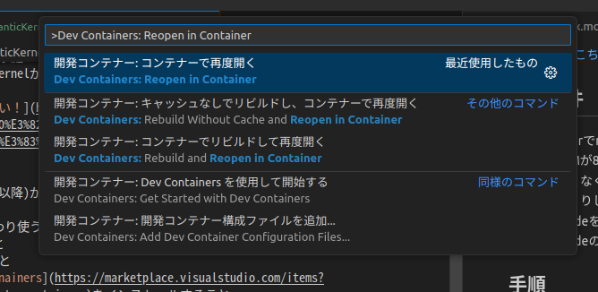
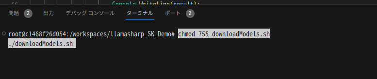

## 背景
最近、生成AIが激アツですね。   
私もその熱に影響を受けた一人なわけで。   
クラウドで生成できるAIはお手軽かつ賢くて素晴らしいのですが、   
やはり、仕事の情報やプライベートの情報をホイホイクラウドに投げるのもね...   
...というのは建前で！本当は手持ちGPUで出来たほうが浪漫があるじゃないですか！(結局それかよ)   
<br>
世間ではもっぱらクラウドで処理する系の生成AIばかり取り上げられていますが、   
LLama系モデルを使うと逸般の誤家庭のPCでできるので、   
今日はそれをベースにSemanticKernelができるというLLamaSharpで遊んでみます！

[PCの構成はこちらの記事をご覧ください！](https://yukimakura.github.io/blog/TH3P4G3(85W%E7%89%88)%E3%81%A8RTX2080%E3%82%92Ubuntu22.04%E3%81%A7%E3%82%BB%E3%83%83%E3%83%88%E3%82%A2%E3%83%83%E3%83%97%E3%81%97%E3%81%9F/)

## 前提条件
1. dockerでnvidiaのGPU(CUDA11以降)が使えること
2. VRAMが8GB以上あること
    - なくてもいいが、その代わり使うモデルを変えたり、`ModelParams`の`GpuLayerCount`を減らしたりして調整すること
3. VSCodeをインストールすること
4. VSCodeの拡張機能に [Dev Conainers](https://marketplace.visualstudio.com/items?itemName=ms-vscode-remote.remote-containers)をインストールすること   
## ソースコード
[yukimakura/llamasharp_SK_Demo](https://github.com/yukimakura/llamasharp_SK_Demo)
## 手順
1. 私のデモレポをクローンする
``` bash
git clone https://github.com/yukimakura/llamasharp_SK_Demo.git
```
2. vscodeで私のレポを開く
```bash 
code ./llamasharp_SK_Demo
```
3. F1を押し、「Dev Container: Reopen in Container」をクリックする

4. 開発コンテナのセットアップが終わるまで待つ   
5. ターミナルを開き、以下を実行してモデルをダウンロードする   
  **合計10GB以上ダウンロードが行われるので要注意！**
``` bash
chmod 755 downloadModels.sh
./downloadModels.sh
```


6. モデルのダウンロードが終わったら、`dotnet run`する
```bash
cd llamaSk
dotnet run
```

## 遊び方
起動時に `アトリと会話する場合は 1 を、SemanticKernelのデモは 2 を入力`と出るので半角数字で1か2を入力する
### 普通に会話する (1)
このモードは普通にllamaのモデルと会話するだけです。   
ちょいちょいアホなところが可愛いです。   
<br>
ちなみになぜ「アトリ」かというと、私が好きなギャルゲーのキャラだからです！笑   
2024年にアニメ化するので絶対に見てくれってばよ！   
ATRIはいいぞぉ(^^)   
[ATRI公式サイト](https://atri-mdm.com/)   

### SemanticKernelする (2)
これは、残念ながらアトリちゃんを混ぜ込めませんでした...(´；ω；｀)   
事前に設定してあるPluginを文章から読み出すデモです。   
このデモでは
- {場所}の天気を教えて
  - これに対する答えは、`{場所}は槍の雨が降るでしょう。(嘘です。実装めんどいからやってない)`と返答します
- {場所}のニュースを教えて
  - これに対する答えは、{場所}をGoogleのニュースAPIから取得して、上位5件のニュースのタイトルを取得して出力します
- {方向}のモーターを回して
  - これに対する答えは、`{方向}側のモーターをまわします！boooooooo!`と返答します
といった問に対して答えるプラグインを実装しています。

ただし、所詮13BのLLMなので、関数を呼んでくれないことが多々あります。   
...というか呼んでくれないほうが多いぐらいかもヽ(･ω･)/ｽﾞｺｰ   

## 動画
<iframe width="560" height="315" src="https://www.youtube.com/embed/kAn2uvd-QFo?si=TiTV55CWF5OxXGTD" title="YouTube video player" frameborder="0" allow="accelerometer; autoplay; clipboard-write; encrypted-media; gyroscope; picture-in-picture; web-share" allowfullscreen></iframe>

## 〆
うん、おもしろい！   
まだ実用性は乏しいですが、夢と浪漫がありますな〜   
そして、一つ思ったことは、**SemanticKernelはある程度モデルが賢くないと成り立たないということ！（当たり前）**   
まぁ、こういう課題も案外すぐに解決されていくのでしょうね...   
最近、MicroSoftがマシンリソースの削減のためにモデルの軽量化やASICの製作など躍起になっていますが、徐々に少ないリソースや専用ASICなどによってオンプレ生成AIは身近になっていくことでしょう！   
AI戦国時代の到来ですな!!   
<br>
今日は記事を2連投しました！   
意外とLLamaSharpの調整に時間がかかってしまい、   
こんな時間になってしまった...   
オムニのロボットのネタとかもあるのに...   
それはまた今度ということで！（絶対書けよ未来の自分）   
では(^^)ノシ


