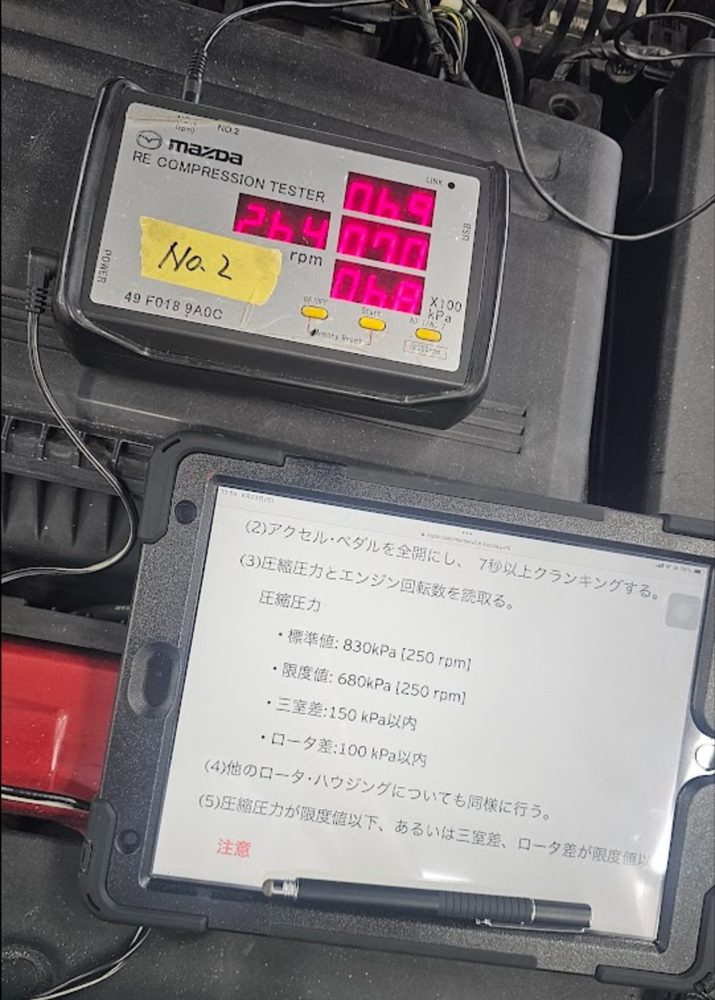

# ディーラーにて一年点検
毎度の通りです。   
なんやかんやディーラーが落ち着く（脳死）   
最寄りが比較的建物が新しいディーラーだからちょっと高級感あって割と好きなんすよね〜    

# 圧縮測定
さぁ！今年も圧縮測ります！   
前回も言いましたが、RE用のコンプレッションテスターはどうやら常備していないようなので   
予約時に宣言をお忘れなく！   

## 結果
### フロント

### リア

...てか今気づいたんだけど、250rpm換算し忘れてるなこれ

## 去年との比較
[昨年](./RX-8の車検に行ってきました！)との比較マトリクスです
| 年 | フロントrpm | フロント1 | フロント2 | フロント3 | リアrpm | リア1 | リア2 | リア3 |
| -- | -- | -- | -- | -- | -- | -- | -- | -- |
| 2023 | 250 | 6.6 |6.6 |6.5 |250 |7.2 |7.1 |6.9 |
| 2024 | 264 | 6.9 |7.0 |6.8 |260 |7.5 |7.4 |7.1 |

250rpm換算で考えるとほぼ一緒って感じですね!   
下がってなくて良かったぁぁ😎   

## シンセレネシス×PCVバルブクリーナーの感想
結論、結構良かった！   
気持ちかもしれないけど吹け上がりは良くなった気がする   
ただ、今年の3月ごろからなんとなく吹け上がりが悪くなったり、(ただでさえ低い)低速トルクが若干落ちたような気がした    
まぁ、変えてから10ヶ月近く経ってたわけですし、しゃーなしかな😅    
今回の1年点検で変えてからはまた元通り！いいね👍   
# 〆
今回は一年点検ということで、店舗で2時間ほど待機で終わりました   
前回と大きく違うのは今回はコンプレッションテストの様子を見学させてもらえました！   
そのためカラー写真というわけです   
昨今の自動車の不正の煽りを受けてるのでしょうね...(てかあれは国交省も悪いだろ😡)   
手間なのは承知ですが、車を愛する1ユーザーとしては非常に良い取り組みだと心から思いました！   
     
...実はここだけの話その日の午前に新たなお車を成約致しまして...   
これで8ちゃんに異常が見つかったら...と内申ヒヤヒヤしておりました^^;   
(クラッチが軋むって？🙉🙉🙉🙉🙉🙉🙉🙉)    
いやぁね？そんなカツカツで新しく車買うなよと。あほんだらかと   
でもね？次の車は8ちゃんに負けないぐらい楽しく、かつロマンチックなので楽しみです！   
かといって8ちゃんは正直手放したくないと思ってます、頑張って2台維持したいなぁ...   
    
さて、今回の合計金額は
| 商品名 | 価格(円、税込) | 技術料(円、税込) | 
| -- | -- | -- |
| シンセレネシス 0W-30 | 13,420 | 1,540 |
| PCVバルブクリーナー  | 3,410 | - | 
|  ガスケット | 99 | - |
| 純正オイルフィルター  | 1,551 | 770 |
| コンプレッションテスト  | - | 10,010 |
| 1年点検整備【乗用車】 レギュラー | - | 22,330 |
| (合計) | 18,480 | 34,650 |

**全合計で53,130円(税込)となりました！**   
もともとの見積もりでは6万と言われてたので安くなってて助かった...   
8ちゃん楽しいよこれからもよろしくね😎   
では(*^^*)ノシ