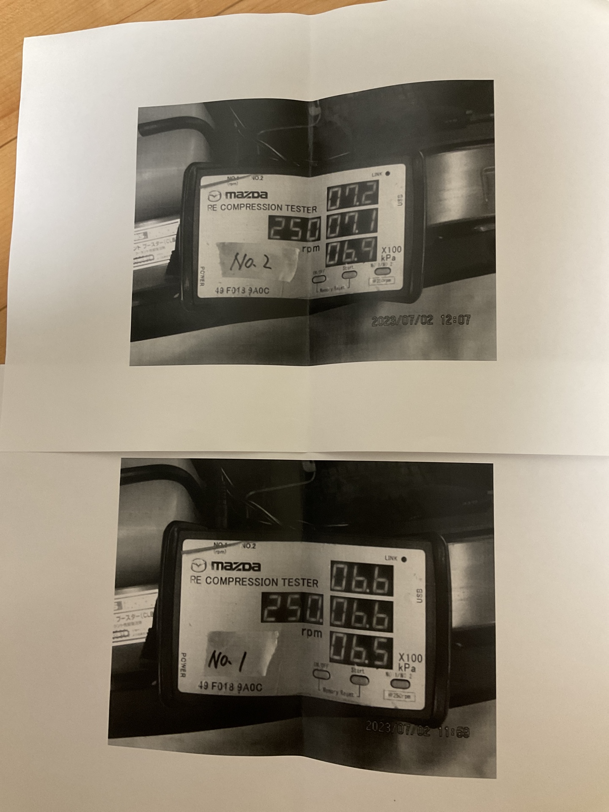

## ディーラー車検
昨年の1年点検は安上げようとオートバックスにお願いしました。   
ところがどっこい、8ちゃんはエンジン以外でも特殊なところがたくさんあるようで、
ラジエターまわりの寿命が来ていたのですが、扱えないと断られてしまいました...   
んで、ディーラーに持ってって15マソかけて冷却周りの取っ替えをしました。
 
そんなかんじで、悩むの面倒くさいので今回ははじめからディーラーにお願いしたわけであります。

## 圧縮測定
自分がうちの子を購入してから、一回も圧縮比を測定したことなかったので    
これを機に一緒にお願いしました。   
ロータリーエンジンはレシプロと明らかに構造が違うので、レシプロ用の圧縮測定器が使えないのです...   
なので、事前に言っておかないと、測定機がディーラーになかったりするので配慮が必要です。   
(本音を言うならディーラーなら1つぐらい常備しておいて貰いたいものですが...)   
### 結果

たしかNo1がフロント、No2がリアって言っていた気がします。   
2008年ものの後期RX-8TypeSで、走行距離は75000kmぐらいです。   
うーん、極端に悪くはないけど、良くもないなぁ...   
もともと、中古で買ったときも店側から圧縮はあんまり良くないので、   
期待しないでくださいと言われていました。   
ちなみにエンジン切る時に吹かさないと、偶にカブることがあります。
## クラッチが軋む問題
長距離の下道ドライブをしていると、クラッチのオンオフを繰り返すことになりますね。
それで、しばらくするとなんか、クラッチペダルの根本のほうがｷｼｷｼ...鳴くようになるんですよね...   
んで、また放置しとくとケロッと治ってる。
ディーラーの人に相談してみましたが、あまり聞かない症例っぽい？
とりあえず、根本のバネ機構付近にグリスをつけてもらって様子見となりました。
## エンジンオイル
いままでは、WacosのProstage-s 0w-30を使っていたのですが、   
ディーラーということで、シンセレネシスを初投入してみました！   
ただ、シンセレネシスだと4L缶となってしまい、400ml足りない   
(Renesis用ならキッチリ合せておこうよ...)らしいので、   
残りの400mlは[PCVバルブクリーナー](https://amzn.asia/d/cEHFiJQ)というものを勧められたので試しに入れてみました。   
一応ロータリーエンジンにも実績あると言っていたので信じます！！！
## 下回り洗浄
雪国や潮風に当たる環境で走行するならやっといたほうがいいと進められたのですが、   
いまのところその予定はない...   
ただ！もう15年選手となる車なので、奮発しちゃいました！   
(ムダヅカイジャナイヨ！)
## 金額明細
ドドーンと公開しちゃいます！   

20マンぎり行かないかな〜と思ってたら足出た(笑)   
そいえば驚いたのですが、今の発煙筒って車のガラス割る機能も備えてるんですって！   
忘れないようにせな...
## (おまけ)代車はMazda3

マツダコネクトもサクサクうごくし、内装おしゃれだし、世界観作り込まれてて、そして安い。   
もっと売れててもおかしくないと思うぐらいいい車でした！   
RX-8にマツコネをつけるか、Mazda3にロータリーエンジンを積むか、   
悩ましいなぁ（笑）   
でもやっぱりRX-8のほうが楽しいですね...   
高級指向なので、静音性がなかなか高かったです。   
故にエキゾーストがあまり聞こえてこない...   
ジレンマなんだなぁ...
## 〆
いやー最初の見積もりで18マンって言われてて、故障箇所見つかって30マンとか、それ以上になったらどうしよう...   
と怯えていたのですが、いい意味で裏切られた結果となったってのがお気持ちです。   
うちの子はフルラッピングしてるので、洗車機に入れられないのですが、    
そこは気を利かせてくれたようで電話で断りを入れてくれました！嬉しいね(^^)   
あと、ドンピシャ今月から、   
**車の車検シールの貼る位置が、運転席側の右端に貼ることが義務化**されたそうです！   
そして、ディーラーの担当者さんが、右上に張ったにも関わらず、   
右上を意識しすぎて、前のやつ(バックミラーの裏に貼ってあった)やつを    
剥がし忘れるというお茶目なシーンがありましたとさ。
では(*^^*)ノシ
