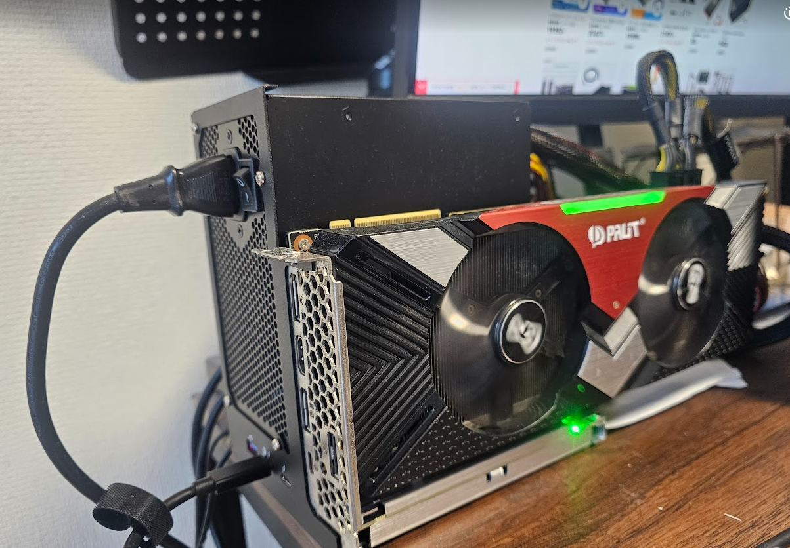

## TH3P4G3(85W版)ってなんぞ？
...まぁ、こんな辺境ブログの記事にぶち当たる方には蛇足と思いますが、   
中華製外付けGPUアダプターです。   
[私が購入したTH3P4G3のリンク](https://ja.aliexpress.com/item/1005006106871443.html)   

2マン前後で購入でき、そのくせThunderbolt3のデイジーチェーン接続にも対応という   
高コスパなのがとても魅力的です。  
しかも！**この85W版はノートPCに85WまでThunderbolt3経由で給電できる**というスグレモノ！   
なんか、見た感じ今年の後半に出たっぽい？   
ほとんど従来版(65W)と値段も変わらないのでこれをポチりました。   
<br>
これはどうでもいい情報ですが、私はちょうど独身の日セールで   
クーポンマシマシで買えたので、約1.6マンほどで買えました〜   
ラッキー(^^)   

## 物理的な構成
### TH3P4G3(85W)
- 主役(？)
- PCIeをThunderbolt3に変換するアダプタ
- **しれっと意外と高いThunderbolt3ケーブルが同封なの助かる**
### GeForce RTX™ 2080 GamingPro OC (PALiT製)
- メルカリで激安で買ったGPU
- VRAMは8GB
- なんかファンがブン回るとクソうるさい
### ATX-1260GA1 80PLUS BRONZE 600W (Enhance製)
- ハードオフで3300円買った動作保証品(ジャンクじゃない)
### ThinkPad X1 Carbon Gen6
- 相棒
- スペック
    - Intel Core i7 8650U
    - 16GB RAM(速度はシラネ)
    - 訳あってWLANはBroadcom bcm94360ng
        - お察しください(^_^;)


## いろいろやったこと
### nvidiaのドライバをインストール
1. GPUをThinkPadにぶっ挿す
2. 設定→このシステムについて→ソフトウェアのアップデート→追加のドライバータブを開く
3. nvidia-driver-535(プロプライエタリ)を選択し変更の適用
4. **再起動せず、eGPU Switcherのセットアップに続く**

### eGPU Switcherのセットアップ
[このQiitaの記事を参考にしました](https://qiita.com/y-vectorfield/items/8960c804441d2ebd605e#egpu-switcher%E3%81%AE%E3%82%BB%E3%83%83%E3%83%88%E3%82%A2%E3%83%83%E3%83%97egpu%E4%B8%8A%E3%81%A7%E5%8B%95%E4%BD%9C%E3%81%99%E3%82%8Bx-window-system)
1. eGPU Switcherをインストール&セットアップ
``` bash
sudo add-apt-repository ppa:hertg/egpu-switcher
sudo apt update
sudo apt install -y egpu-switcher
sudo egpu-switcher setup
```
2. 再起動

**※もし、GUIが死んでも`Ctrl+Alt+ファンクションキー(F2〜F6)`で**   
**CUIの別セッション開けれるのでそこで頑張ってなんとか復旧してください！(力技)**

### (オプション)Dockerのインストール&セットアップ
私は、あまり環境を汚したくないので、基本コンテナで開発してます。   
ネイティブにCUDAを入れるのは汚れる＆ダルいのでDockerでやっちゃいます。   
1. Dockerのインストール [いつもこのQiitaを参考にさせてもらってます](https://qiita.com/KEINOS/items/bdc9450c1a88c210aa88)
``` bash
curl -fsSL get.docker.com -o get-docker.sh && sh get-docker.sh && sudo gpasswd -a $USER docker && sudo docker run hello-world && rm -f get-docker.sh
```
2. 再起動
3. Nvidia Container Toolkitのインストール＆セットアップ   
[このzennを参考にしました](https://zenn.dev/usagi1975/articles/2022-09-05-000000_docker_gpu#nvidia-container-toolkit%E3%81%AE%E3%82%A4%E3%83%B3%E3%82%B9%E3%83%88%E3%83%BC%E3%83%AB)
``` bash
distribution=$(. /etc/os-release;echo $ID$VERSION_ID) \
  && curl -fsSL https://nvidia.github.io/libnvidia-container/gpgkey | sudo gpg --dearmor -o /usr/share/keyrings/nvidia-container-toolkit-keyring.gpg \
  && curl -s -L https://nvidia.github.io/libnvidia-container/$distribution/libnvidia-container.list | \
  sed 's#deb https://#deb [signed-by=/usr/share/keyrings/nvidia-container-toolkit-keyring.gpg] https://#g' | \
  sudo tee /etc/apt/sources.list.d/nvidia-container-toolkit.list

> sudo apt update && sudo apt install -y nvidia-container-toolkit

sudo nvidia-ctk runtime configure --runtime=docker
sudo systemctl restart docker
```
4. コンテナ内でGPUが認識されているか確認する
```bash
docker run --rm --gpus all nvidia/cuda:12.0.0-base-ubuntu22.04 nvidia-smi
```
これで、nvidia-smiを確認できればおｋ！

## 〆
eGPU Switcherによってめちゃくちゃ快適なeGPU✕Ubuntu環境ができました！   
自分は3DCGというよりも、生成AIで遊びたいので、あまりVRAMの無駄遣いをしたくありません。   
その点、ラップトップだと内蔵グラフィックスがあるので、   
そいつで描画させて、GPUはCUDAだけみたいな感じが可能です。   
はたまた、描画にGPUを使いたければ、eGPU Switcherをいじったり、   
GPUの映像端子にケーブルさすなりすればRTXぱわーを感じれるわけですな。   
<br>
ちな、安定性は3日間起動しっぱなしでもモウマンタイだったので   
自分的には💯でした。   
(ただし、描画は内蔵グラ設定)   

今回かかった金額(ノートPC除く)は
- GPU (20000円)
- 電源 (3300円)
- TH3P4G3 85W (15744円)

で合計**39044円!**   
ギリ4マン切った！やったぜ！  
<br>
TH3P4G3、おすすめです。   
(写真撮り忘れたけど、梱包が結構しっかりしてて驚いた)   
みなさんも是非遊んでみてくださいな！   
では(^^)ノシ