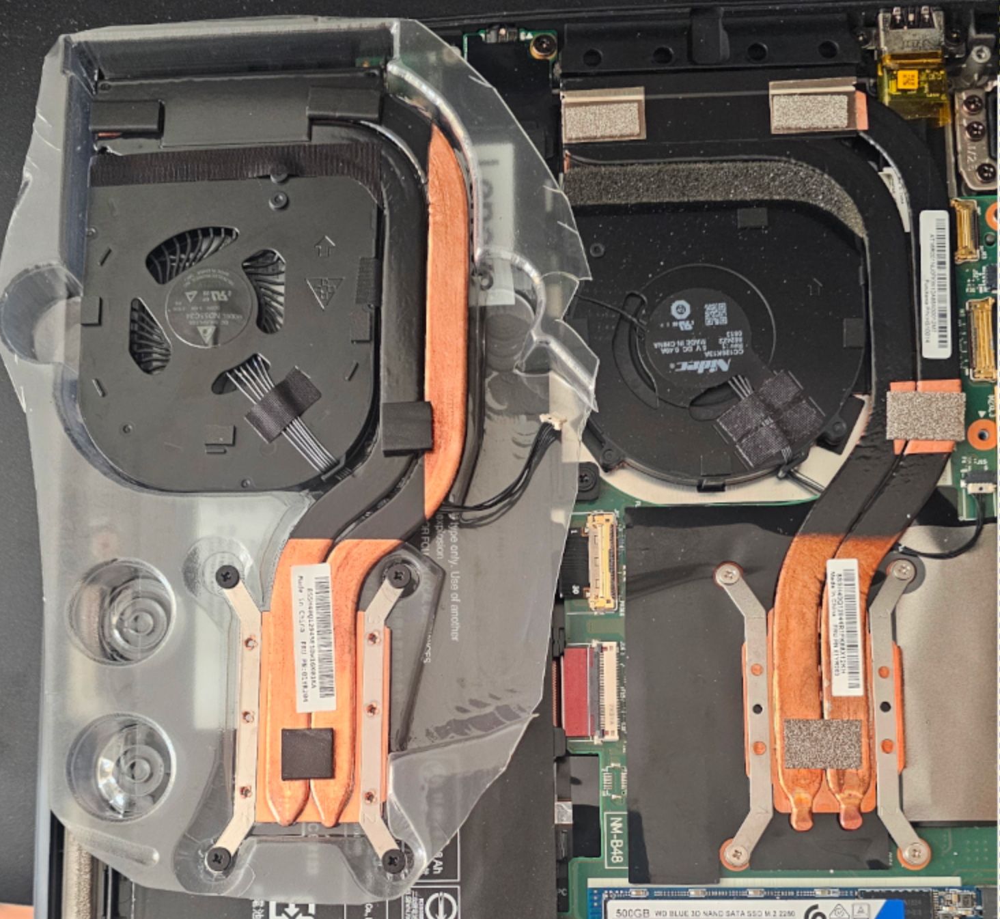
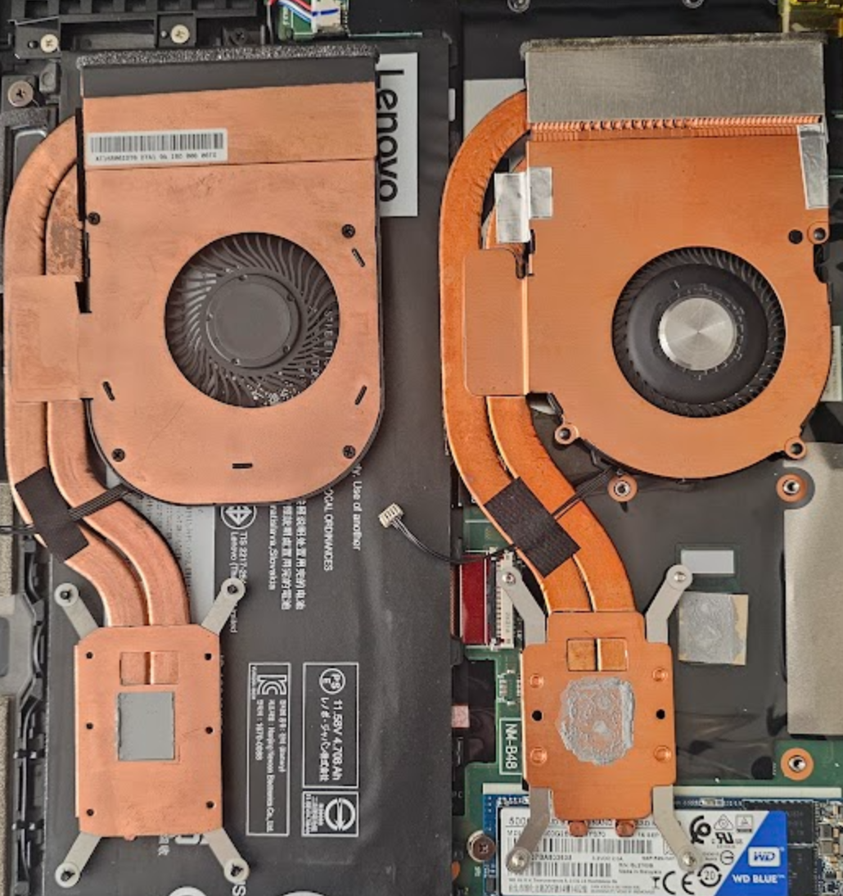
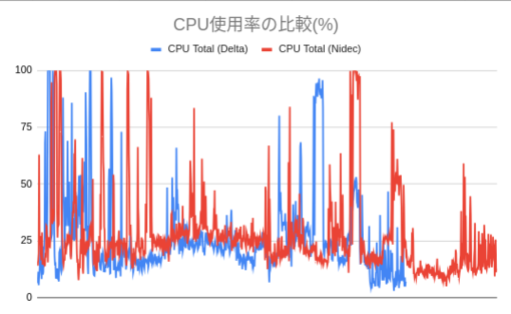
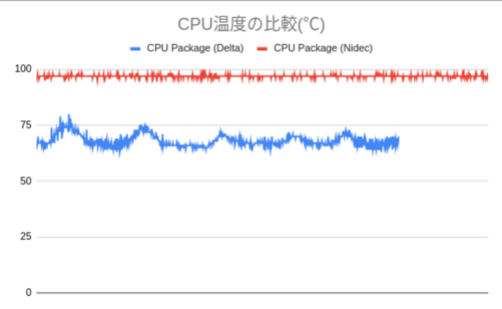
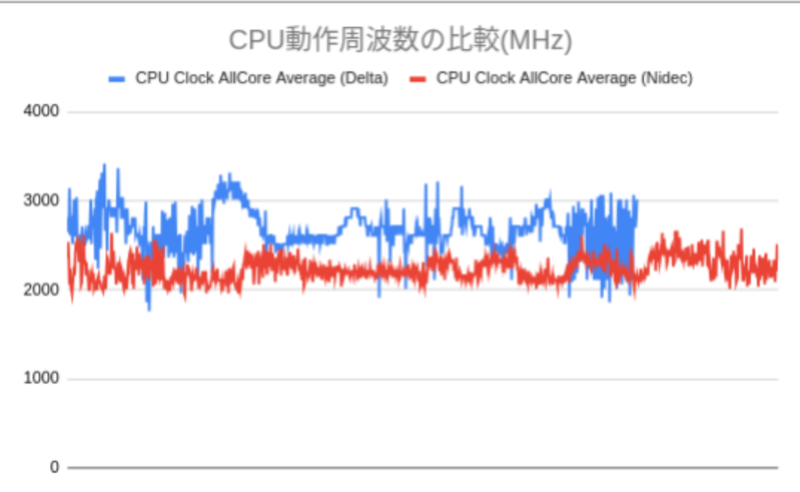
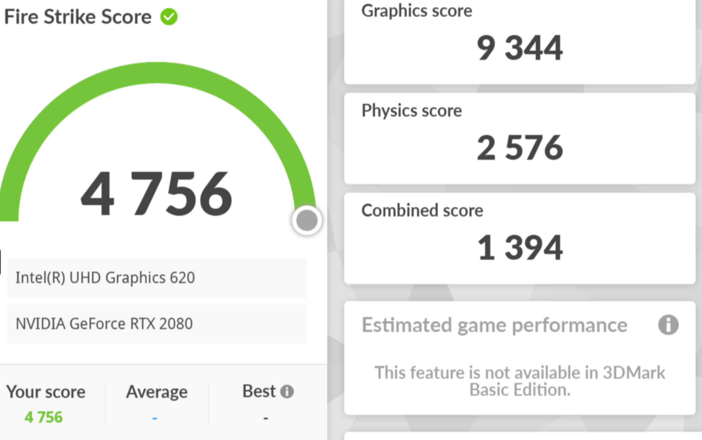
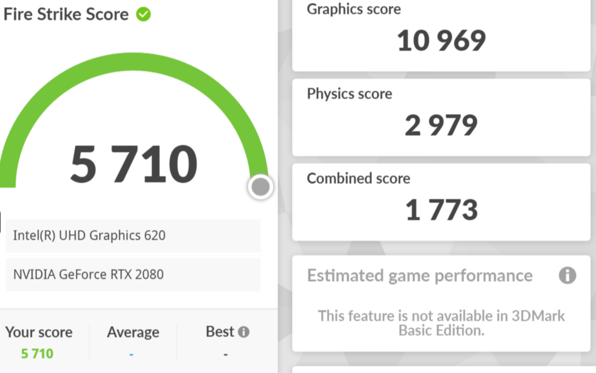

## ネタ元
[reddit](https://www.reddit.com/r/thinkpad/comments/c7zpah/x1_carbon_6th_gen_horrible_cooling_fan_design/)   
↑概要としては、夫婦でThinkPad X1 Carbon Gen6を買ったのだが、   
妻の機体が明らかにうるさい＆サーマルスロットリングが起きているというもの  
ちなみに、**うるさい方がNidec製の模様(日本電産どうした！！？)**

んで、うちの子も裏蓋開けたら**Nidec製でした...**   
Ubuntuでは、パワーマネジメントが上手いのかぶっちゃけあんまり気にならなかったのですが、   
ひょんな事から、Windowsのゲームが遊びたくなり、**Windowsで使うと、めちゃくちゃ悲惨！！！**   
ということで、アリエクで仕入れてみたので比較しますぞい

[商品リンクはこちら](https://ja.aliexpress.com/item/1005006413511193.html?channel=twinner )

## 写真で見る違い

写真左側が今回買ったファンで、右側がNidecファンです  
**ひと目見ただけで明らかに通気口のサイズが違うことが分かります**   
Nidecは空気吸う気ほとんどないですね^^;   

余談ですが、アリエクの写真ではよくわからないメーカーの絵だったので期待していなかったのですが、   
実際届いたものを見ると、Delta製のシールが貼ってありました！   
まぁ、その代わりに中古っぽかったですけど、良しとしましょう（寛容   

## ベンチマークや観測方法
- TH3P4G3にてRTX2080を外付け
- 3DMarkのFireStrike（アルティメットじゃないやつ）
- Windows11 23H2
- OpenHardwareMonitorにて1Hzごとにセンサーデータをロギング

## 計測結果
### CPUの使用率、温度、動作周波数の推移
CPUの使用率、温度、動作周波数の3つの観点でグラフ化しました   
※微妙にデータの取得数が違うのはご了承ください🙇‍♀🙇‍♀🙇‍♀
   
   
   
   
 
 

### 3DMarkの結果
#### Nidec

#### Delta

**約20%もスコアが向上しました！！！**

## 考察とか感想とか
- 換装前は起動しただけで100℃手前
    - そりゃクロック上がらんわな...
        - 2.2GHzが平均ぐらい。それ以上は上がらん
- 音は静かになった
    - 計測手段を持っていないので官能検査ではあるが、静かに鳴った気がする
- 風量も増えた気がする
    - 官能検査（以下略

## 結論
おすすめ！   
ThinkPad X1C6が気に入ってるなら5000円の投資の価値ありかと

では(^^)ノシ   