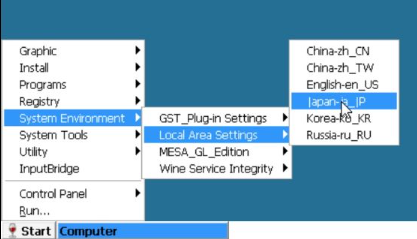

# 閑話休題(挨拶)
みなさま、あけましておめでとうございます（は？   
...ってもう2月ですね、すんません。   
今年初記事でございます   
元日は実家に戻っていたのですが...   
やれ地震だの大津波警報だのてんやわんやな正月でした...   
落ち着いて酒も飲めなかった...   
一応、サービスエリアまで死ぬ気で家族で逃げたので被災者です（被災者ヅラすな   
なんせ実家すぐ海なんでね...怖くてしゃーなかったです    
震源地の人はいまも辛い思いをされてると思います。   
復興は大変だと思いますが、ぜひとも頑張ってください（ある意味残酷な言葉よな   
 

# 準備物
- [Winlator Mr.J Fix41(V3.2).apk と main.3.com.winlator.obb](https://mega.nz/folder/Li4yQTxR#JJavQFVe0IY7CSQChprx4Q)
- ファイラーアプリ

# How To
1. Mr.J版APKをインストール
2. (Amdroid 11以降の場合)任意のフォルダーの権限をWinlator宛に適切に割当、そこに、`main.3.com.winlator.obb`を設置する
    - これをしないとobbのインポートに失敗するため要注意(これにハマった)
3. Winlatorを起動する
4. 起動したあと、権限が求められるので承認し、`Unable to find the obb image.`とポップアップが出るが、`Cancel`を押す
5. アプリ内の`Settings`を開き、一番下までスクロールすると`Install OBB Image`ボタンがあるのでそれを押し、`Open File`を押す
6. 2で設置したobbファイルを選択する
7. `Installed Version`が0.0から変わっていることを確認する
8. トップページへ戻り、適当なコンテナを作成し、起動
9. コンテナ内の`Start`ボタンを押し、`System Environment`→`Local Area Settings`→`Japan-ja_JP`を押す   

10. コンテナ再起動して、日本語化されているか確認する   
 
以上!

# 〆
このブログで一番盛り上がっていたWinlatorネタです（笑）   
Winlatorの記事だけ異様にアクセスされてるという...    
やっぱみんなギャルゲーをポータブル化したいんやなぁって
 
本当は、サクラノ刻のムービー再生時問題解決してから記事化しようかと思ってたのですが、
12時間ぐらい格闘してもダメだったんで、一旦日本語化のみで上げます。   
いくつか、心当たりはついていて
- どうやら、ムービーのコーデックは`wmv`らしく、これがめんどくさい
    - DXVK ✕ Wine 64bitがwmvとすこぶる相性悪いらしい
- そもそもwmvのコーデックが入ってない？
    - Mr.J版だとそうかも？
    - ピュア版のWinlatorだと、DXVKは相変わらずダメだが、WineD3Dだと途中まで行ける   

が調べた結果です。
winetrickが使えればもう少し進めやすいのですが、それがないのがキツイ...
海外のフォーラムのニキが、`wmvというクソコーデックのせいでゲームができないのは問題だ`と嘆いていました...ほんとそれな...  
  
...まぁもう少し調べてみます   
Ethornellさん、もうそろそろ動画のコーデックヲx264とかにしませんかね??   
最近、ガンダムSEEDのラクス構文というのが密かに流行っているらしいのですが、   
それを借りると、     
「ゲームの中でwmvを再生したいのではありません。やりたいゲームの中にwmvが紛れ込んでいるのです！」ってお気持ち。

今日はここまで！   
では(^^)ノシ   
