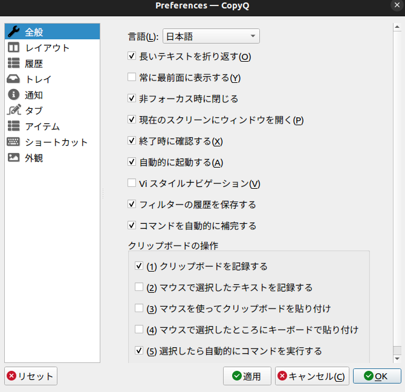

## Win10以降のクリップボード履歴、良き
正直あまりWindowsが好きではないゆきまくらです（ドモドモ   
ただ、近年のWindowsで ` Win + v` で呼び出せるアイツ、クッソ便利なんよなぁ...   
...ということで、Ubuntuちゃんでもこれを実現していきましょう！

## copyqを導入する
``` bash
sudo apt install copyq
```
簡単お手軽ですな(^^)

## セットアップ
1. UbuntuのOSの設定から、`super + v`のショートカットを消す

2. UbuntuのGUIメニューからcopyqを起動
3. 設定画面を開く

4. 自動起動ON

5. `マウスカーソルの下にメインウィンドウを表示`のショートカットを`super + v`にする


## 動作確認

任意の場所で `super + v`を押すことで、   
マウスポインターの周辺にcopyqの履歴画面が出てこればOK!   

## 〆
Ubuntuが120％使いやすくなったぞ！（雑   
では(^^)ノシ