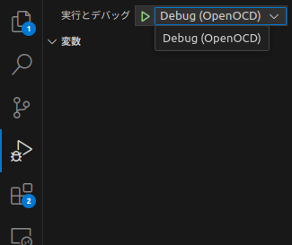

# あいさつ
2025年あけましておめでとうございますm(_ _)m   
昨年は、いろいろありました...   
- 元日から大地震
- 転職(愛知→東京)
- 車の買い替え(後日記事化予定)
漢字1文字で表すならば「動」か「変」が似つかわしい1年でした！   
今年のモットーとしては、英語をなんとかしたいってところですかね...   
ということで、今年もどうぞよろしくおねがい致しますm(_ _)m   

# stm32-rsについて
RustはLLVMを経て様々なアーキテクチャのバイナリを生成することができます。    
stm32は皆さんご存知STMicroのマイコンなわけですが、Arm系アーキテクチャ(ただしマイコン用)なのでLLVMとしても対応しています。    
**Rustの素晴らしいDX(開発体験の方ね)をこの高コスパのマイコン開発に活かせれるわけです！**   
   
ただ、(STM32のビルドツールなどの)開発環境を整えるのが若干めんどいのが欠点...      
この記事はそれすらを解決しようという目的です。


# 前提条件・事前準備
- Ubuntu22.04かDebian12のLinuxOSマシン
    - それ以外はカーネルパニックになっても知らないぞ！（・∀・）ﾆﾔﾆﾔ
        - WSL2は想定してないが、USB-IPの仕様次第?(そもそもまだ入ってなかったっけ?)
    - 新しいバージョンな分には問題ないはず...
    - 一応、Ubuntu20.04でもデバック開始とブレークポイントできた
- VSCode
    - [Dev Container拡張機能](https://marketplace.visualstudio.com/items?itemName=ms-vscode-remote.remote-containers)
- Docker
    - DevContainerする場合はそりゃ必要。ない人は入れよう！
        - `curl -fsSL get.docker.com -o get-docker.sh && sh get-docker.sh && sudo gpasswd -a $USER docker && sudo docker run hello-world && rm -f get-docker.sh`
            - [いつもお世話になってるQiita記事(ありがとうございます)](https://qiita.com/KEINOS/items/bdc9450c1a88c210aa88)
    

- stm32マイコン(Nucleoでも可)
    - **J-Link化されている場合は本記事スコープ外**
- st-link(Nucleoじゃない場合は必要)

# 手順
1. 任意のフォルダを作成し、それをVSCodeで開く
1. `.devcontainer`フォルダを作成し、その中に`devcontainer.json`と`init.sh`を作成
(ホストOSのバージョンが古い場合は、[imageを調整してください](https://hub.docker.com/r/microsoft/devcontainers-base))
``` json{3}:title=devcontainer.json
{
	"name": "Ubuntu",
	"image": "mcr.microsoft.com/devcontainers/base:jammy",
	"features": {
		"ghcr.io/devcontainers/features/rust:1": {},
		"ghcr.io/devcontainers/features/common-utils:2": {
            "username": "root"
        },
        "ghcr.io/devcontainers/features/git:1": {}
	},


    "containerEnv": {},
    "remoteEnv": {},

	// ## IDE
    "customizations": {
        "vscode": {
            "extensions": ["marus25.cortex-debug"],
            "settings": {}
        }
    },

	"postCreateCommand": ".devcontainer/init.sh && cd /home/developer && tar -xvf /home/developer/gcc-arm-none-eabi.tar.bz",

	"remoteUser": "root",
	"runArgs": [ "-v","/dev:/dev", "--network" , "host","--device-cgroup-rule","c 189:* rmw"]
}

```
``` bash:title=init.sh
#!/bin/sh
sudo apt update
sudo apt install -y openocd pkg-config gdb-multiarch aria2
sudo ln -s /usr/bin/gdb-multiarch /usr/bin/arm-none-eabi-gdb

aria2c -x16 -s16 -d /home/developer -o gcc-arm-none-eabi.tar.bz https://developer.arm.com/-/media/Files/downloads/gnu-rm/10.3-2021.10/gcc-arm-none-eabi-10.3-2021.10-x86_64-linux.tar.bz2?rev=78196d3461ba4c9089a67b5f33edf82a&hash=5631ACEF1F8F237389F14B41566964EC


rustup target add thumbv6m-none-eabi
rustup target add thumbv7em-none-eabi
rustup target add thumbv7em-none-eabihf
rustup target add thumbv7m-none-eabi

cargo install cargo-generate

# tar -xvf /home/developer/gcc-arm-none-eabi.tar.bz
```
3. あとは[このQiita記事](https://qiita.com/Kosuke_Matsui/items/031b2d60f3242617115e#%E3%82%B5%E3%83%B3%E3%83%97%E3%83%AB%E3%83%97%E3%83%AD%E3%82%B8%E3%82%A7%E3%82%AF%E3%83%88%E3%81%A7%E5%8B%95%E4%BD%9C%E7%A2%BA%E8%AA%8D)に習って設定を進める
1. デバックは、OpenOCDを選択して実行すること

1. (おまけ)[Embedded-halを使うともう少し開発しやすくなるはず](https://zeptoelecdesign.com/rust-embedded3/)

# Example
[ゆきまくら製の例(Github)](https://github.com/yukimakura/stm32-rs-devcontainer-nucleo-f446re)

# 念の為注意
- 多分、Github CodeSpaceでは(クラウドのため)実行とデバックできないので注意   
    - もしかするとUSB-IPを頑張ればできるかもだけど、この記事ではスコープ外とする

## 〆
DockerとDevContainer優秀すぎ問題。   
案外、組み込み開発では話題に上がりにくいコンテナ仮想化ですが、   
普通に設定次第でハードデバイスにアクセスできるので、    
この界隈でももっと話題になっても良いと思ってます。   
(コンテナ仮想化の原理的にはできて当然なんよな)      
   
意外と開発体験で躓く人って多いと思うんです(私も昔はそうだった)     
なので「誰もが、迷わず、素早く」構築できることって結構重要だと思います。   
    
是非是非、みなさんもRust✕STM32開発挑戦してみてくださいね！   
    
では(*^^*)ノシ