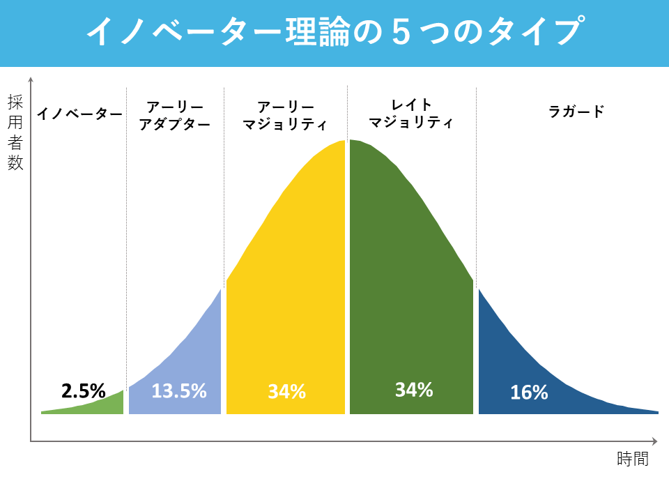
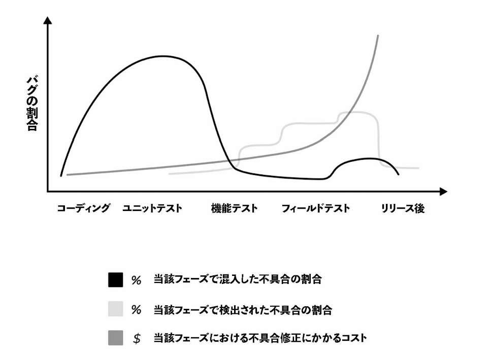

# 手法
各章にまとめがあるのでそれを箇条書き方式で詳細を枝生やしていく
※ゆきまくらが思ったことは項目末尾に `(感想)` と記載している

# 1章 品質と価値
- 歴史は繰り返す。ソフトウェア開発も製造業と同じように初めは **速さという最適化を重視し、次に品質を通じて顧客価値を重視**
    - TQM(Total Quality Management:総合品質管理)
        - 品質を「生産工程に焦点を合わす」のでなく、 **「顧客への価値提供」** と定義した
- 粗悪な品質は顧客・会社・あなたのキャリアの「３つのC」に悪影響を及ぼす
    - 品質がお粗末だったために企業が支払ったコストを合わせると、2017年は約200兆円と算出されている
        - その年のカナダのGDPに匹敵する金額
    - バグフィックに**疲弊し続ける環境ではエネルギー・創造性・モチベーションがチームから失われる**
        - このような状況ではいくらマネジメントしても悪循環しか起こり得ない
- 「3つのC」に良い影響を及ぼすために、ビジネスの成果と顧客価値に当てるべき
    - テストをするという「プロセス」にとらわれるのではなく、**顧客価値を意識してビルド・機能開発・バグフィックの優先度を決めるべき**
---
# 2章 3つの品質ナラティブ
- ナラティブとは...
    - 「物語」「話術」「語り」といった意味を持つ
        - 相手（患者、部下、顧客など）視点での物語を重視すること
        - [ナラティブとは？【意味をわかりやすく】ストーリーとの違い(カオナビ)](https://www.kaonavi.jp/dictionary/narrative/)
- **品質ナラティブとは、企業で品質について考えたり話したりしてるその「語られ方」**
- 組織の品質文化は、意識して表明しているかどうかに関わらず、**品質ナラティブ**として存在している
    - 文化というものの本質は**どのような立場であろうと、誰もがその企業の文化を宿していること**
        - 例えば、文化という概念に疑り深い起業家が「文化とか言う曖昧なものなどどうでも良い！結果とパフォーマンスがすべてだ！」という発言こそがその文化を示している

- 品質ナラティブは以下で構成される
    - 責任ナラティブ: 誰が品質に責任を持つかが考えられ、語られている
        - 例):経営層の判断により、AndroidアプリよりもiOSアプリに優先度を割きすぎた結果、Androidアプリの品質が壊滅的になり、結果として競合にユーザーを奪取された
    - テストナラティブ: 品質向上につながる正しいテスト技法はどれか・どのツールを使うべきかが考えられ、語られている
        - 例):ある特定のテスト技法やツールさえあれば、品質を向上させられると錯覚してしまうこと
            - 銀の弾丸はない
            - 戦略とは**本質的に問題解決であり、裁量のアプローチは直面する具体的な問題により異なってくる**
    - 価値ナラティブ: 品質に投資した場合の見返り（ROI: 投資収益率）が考えられ、語られている
        - 例:)品質を最大化すべき投資として扱う人と、最小化すべきコストとして扱う人
            - 経営人は品質への投資がもたらす具体的な価値を必ずしも納得しているわけでない

- 品質ナラティブを理解することは、組織の品質文化を転換するための第一歩である
    - まず、現在の社内のナラティブを把握する
        - 組織のさまざまな授業員に「業務で耳にする、品質に関する発言のトップ3」を聞くと従業員が品質についてどう考えているかフィルタリングされていない答えが得られる
    - 次にそれをどのようにしたいかを考える
        - 品質を社内外でどう認識してほしいのか
        - 1年後にはどんなチームになっていてほしいのか
---
# 3章 品質文化醸成
- 社内で品質のリーダーシップを発揮するためには、影響力と説得力を身につけねばならない
    - リーダーであれば何らかの形で「売らない売り込み」に何時間も費やしている
- 影響力を発揮できるようにする方法は以下である
    - **誰を味方につけるかを知る**、そして彼らのモチベーション・目標としているもの・恐れているものが何であるかを知る
        - 重要なステークホルダーの洗い出し、彼らにゴールや課題、反対する理由や彼らが属するチームに与える影響を質問してみる
            - 説得して味方につけたい相手のことを詳しく知れば、**確実にアピールできる伝え方が見つかる**
                - より多くの賛同者の支持を集められるだろうし、アイデアは更に明快に理解されるだろう
        - **経営層を相手に話すときは、顧客とビジネスにどんな影響があるかを中心に捉えるべき**
            - [システムアーキテクチャ構築の原理のビューを彷彿とさせた(感想)](https://amzn.asia/d/06eFg9cH)
    - チーム同士・メンバー同士の**共感を生み出して連携と相互理解を深める**こと
        - 例):営業部長とカスタマーサポート部長を入れ替えたら共感が醸成され、いかに目標を達成するかにフォーカスした共通の視点が作られた
            - ここまで大げさにやらずとも、短期間的に異なる分野の人々が同じ業務を行うことでアイデアを共有すればよい
                - **ペアリングセッション**という
            - Atlassian社では開発エンジニアと品質チームをうまくペアにしている
                - この例では品質チームから探索的テストのやり方を教わり、良いテストシナリオを開発者が導けるようにしている
            - ランチ&ラーニング
                - 経営陣と昼食をとりながら対話する活動
                - **経営陣と運用面を担う人たちとの間に醸成される共感もある**
    - 自分の考えに重みを持たせるために、**エビデンスを用いて品質ナラティブを補強する**こと
        - 社内から得られるエビデンス
            - 自社で持っている情報やデータ、チームで試した取り組みなど
        - 社外から得られるエビデンス
            - 他社事例や統計情報など
                - ただし、**共感してもらうというより信頼してもらうためと捉えるべき**
    - 勢いを生み出すために、**社内で品質推進者を増やす**こと
        - アイデアを受け入れてくれそうな役員を見つけ関係を構築しよう

---
# 4章 手動テストと自動テスト
- 自動テストは銀の弾丸でない。間違ったテストは逆に品質を悪化させる可能性がある
    - 本の事例たち
        - テストインフラの一部を最適化しすぎた
        - アプリケーションの一部は**自動テストが実行可能になるよりもずっと早く変更されていった**
        - **テストインフラは壊れたままだった**
        - 複数の異なるテストツールをすべて一緒に動作させようとして、大変な時間を要した
        - バグが自動テストをかいくぐっていき、ユーザビリティが壊滅的になっていった
- 「すべてのテストを自動化できるか？」という疑問に対しては、テストに以下のタイプがあることを考え答えを出す
    - **調査** : 認識されていない情報を明らかにするためのテスト
        - テストケースの想像力が大事
        - どれだけ多くの探索的テストができるか
    - **検証** : プロダクトの情報が期待通りかをチェックするテスト
        - 何が起こるべきかを期待した状態で行われる
            - **通常は成功か失敗かの2択しか無い**
- 「すべてのテストを自動化すべきだろうか？」という質問に対する答えは、以下の要素から考える
    - そのテストを自動化した場合、変更の手を入れることなく長期にわたって利用できるか
    - 自動化したいテストケースの手順が比較的シンプルなものか
    - テストを自動化することで手動で行うよりもコストを抑えられるか
    - これらの話は[単体テストの考え方/使い方](https://amzn.asia/d/0849tXrV)が詳しい(超良書)

---
# 5章 プロダクトの成熟度と品質
- ユーザーは、**イノベーター**から**アーリーアダプター**を経て、**レイトマジョリティ**や**ラガード**へと増えていく
    - 
        - 引用:[イノベーター理論をわかりやすく解説！【事例あり】東大IPC](https://www.utokyo-ipc.co.jp/column/innovation-theory/)
- 製品ライフサイクルの中で、QA(Quality Assurance、品質保証)へのアプローチが変化するのは、大きく3つにカテゴライズされる
    - **実証段階**: プロダクトマーケットフィットを模索する
        - ヒットするかわからないため、品質というよりも以下にPoCできるか
            - プロダクトの初期ユーザーは問題に寛容なユーザーが多い傾向だが、**成熟した業界であるほど期待値は通常高くなる**
    - **予測可能段階**: スケールに向けて安定したインフラを模索する
        - 通常、チームがこの段階で焦点を当てるのは**ソフトウェアの安定性**
            - 実証実験での不足したテストを挽回しなければならない
                - TDDベースで開発するとリファクタもしやすい
    - **スケーリング段階**: マイナスの影響を最小限に抑え、成長への扉を開け放つ
        - この段階になると1%の影響すらブランドイメージに大打撃を与えかねない
            - ブランドというのは、**すべての資産の出来の良さに関連付けて認識されるもの**

- うまく行かなくなってきたというのは、必ずしもQAが失敗し始めたことの表れとは限らない
    - ニーズの変化に合わせて戦略を適応させることが、成功のために必要だと示唆されている
        - プロダクトが成熟して複雑になり、同時ユーザーが増えるにつれ品質に関する課題が変わっていく

---
# 6章 継続的テストとフィードバックループ
- 本当の継続的テストを提供するためには、最初のコンセプトから稼働後まで、すべての段階でテストを行う必要がある
    - **自動テストはソフトウェア開発ライフサイクルを構成する要素の1つにすぎない**
        - 
    - 85%以上のバグが開発の設計とビルドの段階で生じており、ときには1行もコードを書かないうちにバグが混入することもあり
        - 早い工程でバグフィックスしたほうがコストが抑えれる
            - 確かコストは指数関数的に増えたはず(感想、ソースは忘れた)

- 開発パイプラインをよく理解し、それぞれの段階で開発チームにどのようなフィードバックを提供する必要があるか知る
- どんな情報が求められているかに応じて実施するテストの種類が決まる
- テストの種類ごとにフィードバックループは異なっており、得られる情報・かかるコスト・フィードバックまでの時間に違いがある
    - ユニットテストは即座に結果がわかるが、探索的テストは中には数日もかかるものがある
- フィードバックの最適化には以下の分類がある
    - スピードよりも価値を優先する
        - どれだけフィードバックが早くても、エンジニアが求める情報でないと意味がない！
    - 同時並行のテスト実行でスケールを拡大する
        - テストが可能な限りモジュール化され、分離していることが大事
    - 継続的改善を通じて学ぶ
        - ただバグを見つけるだけでなく、同じミスが2度と起こらないように振り返り(レトロスペクティブ)をするべき
    - チームを活かすインフラを構築する
        - 開発パイプラインをマップ化し、どこでどのようなフィードバックが必要なのか特定することがベストな改善の余地の探り方
        - 詳細は7章で語られる

---
# 7章 テストインフラへの投資
- 品質を上げる方法はテストだけではなく、問題を迅速に修正できるようなインフラが整備されていることも重要  
    - 自動テスト、自動デプロイ、容易なロールバック
- CDが実装されると、本番環境で問題が発見された場合に迅速にリリースしたり、ロールバックしたりできる
- モニタリングとアラートシステムは「原因ベース」ではなく「現象ベース」であるべき
    - これにより、チームはユーザーが被った影響に集中できる
        - ユーザーが本当に気にしていること
            - 正常に使えること: 「ページが見つからない」と表示されるエラーが起こったり、画像が表示されないなどの、何かが利用できない状態で無いこと
            - レイテンシー: データのロードが常にクイックに行われること
            - 完全性・永続性・最新であること: 格納されているデータがセキュアに守られていて、使いたいときに使えること
            - 機能: 使いたい機能が正しく利用できること
            - 情報セキュリティのCIAにつながるものを感じた（感想）

- 本番環境でのテストでは、ユーザーが使用するものに最も近い環境でテストを行うことでプロダクトの品質を最も明確に理解できる
    - 例): 開発エンジニアが継続的にデプロイし、重要な指標に関わる影響をモニタリングし、問題が発生したときにロールバックできる強固なインフラを整備する
        - より本質的なテストの価値をQAチームも開発チームも見出すことができるようになった
    - カナリアリリースという手法もある
        - プロダクトを開発する社内チームや一部のユーザーだけに対し、限定的に機能をリリースする手法
- 本番環境でのテストを実施するにはベストプラクティスに習熟していなくてはならず、**それさえやればその他のテストは不要と考えるべきではない**
    - あくまで本番環境のテストは手法の一つに過ぎず、**本番環境以外のテストを一切しないと大問題になる！**

---
# 8章 チームと会社の成長指標
- 成長指標は企業の成長に最も大きな影響を与え、顧客が企業のプロダクトやサービスから最も価値を得ているところに見出される
    - 虚栄の評価基準(リーン・スタートアップより)
        - 成果につながっているように感じられるが、行動に繋がりにくく、ビジネスの成功とも相関しない数値である
            - 例): テスト実行にかかる時間や検出バグ数など
                - それを最終的なゴールにするのではなく、顧客価値という道のりの途中にある分には問題ないはず(感想)
- 成長指標は主に以下に分類される
    - **アテンションベース（注目ベース）**: B2C企業でよく適用される 
        - プロダクトの本質がエンターテインメントや情報を提供するものである場合に有効
            - ユーザーがどれだけの時間を費やしたかに注目した成長指標
    - **トランザクションベース（取引ベース）**: Eコマースやマーケットプレイスを手掛ける企業でよく適用される
        - プロダクトの本質が、ユーザーに商品やサービスを購入させることである場合に有効
            - ユーザー体験を最適化すること及び購入行動の摩擦を低減させることに注目する成長指標
    - **プロダクティビティーベース(生産性ベース)**: B2B企業でよく適用される
        - プロダクトの本質がデジタルタスクやワークフローを完遂できるよう顧客を支援する場合に有効
            - 顧客に与えられたタスクをどれだけ素早く成功させられるかに注目する成長指標
- 成長指標を特定するには顧客に提供してコアバリューを調べ、それを測定に利用する
    - ビジネスのコアと自分たちの作業を結びつけることで、取り組みの価値を自チーム内、同僚、マネージャーと共有できる
- 企業の成長指標が何であるべきかが特定されたら、品質に関わるすべての活動をその指標に集中したものにする
    - こうすると、企業の成長を促進するものを中心としたチーム連携が図れる

---
# 9章 ローカルペルソナ
- 共感エンジニアリング
    - エンジニアが顧客や顧客を直接サポートする人と一緒に時間を過ごすことで、プロダクトや機能の開発にあたって顧客がどう考えるかを理解できる
        - デザイン思考と通ずるものを感じた(感想)
            - 共感（Empathize）
            - 定義（Define）
            - 概念化（Ideate）
            - 試作（Prototype）
            - テスト（Test）
- アプリケーション利用者のユーザー体験は利用しているデバイスやOS、そして場所によりまったく新しいものとなる
    - お国柄ってやつ(感想)
- 顧客が求める品質を確実に体験できるようにするには、実環境でのテストを目標にする必要がある
    - **プロダクトがローカルペルソナに対して確実に価値を発揮できるかを確かめれるよう、テストをローカライズできるかが重要**
- ローカルペルソナの環境でテストするために取れる方法には以下のものがある
    - チームを現地に派遣してテストする
        - 持てる限りのデバイスをチームに持たせ、ローカルペルソナと同じ環境でテストを行うやり方
            - コストはかかるが、現地特有の問題を一番把握できる
    - ベータ版のユーザーなど既存のユーザーの力を借りてプロダクトをテストする
        - 欠点としてコミュニティーを管理するのに追加のコストや手間がかかり、ボランティアのメンバーはクラッシュログや再現手順などを明確に与えてくれないかもしれない
    - クラウドソーシング型のテストプロパイダーなどの外部パートナーと協力する

---
# 10章 品質戦略のリード
- ビジョンが必ず先だ
    - **明確なビジョンがあればそのうち正しい戦略がついてくる。**
- まず自分自身のビジョンを定め、それが自分の会社・チーム・部門のビジョンに沿っているか確かめる
    - 優れたリーダーなら誰でも自分がすることの理由を明確に理解することから始めると指摘されている
        - TEDトークの「優れたリーダーはどうやって行動を促すか」より
    - 自分自身のビジョンは長期的に、チームでのビジョンは1〜2年を目安に
- 目的地と現在地を評価してスタート地点とし、戦略を策定するために何が重要なのかを理解する
    - 現在の品質ナラティブ、プロダクト成熟度、プロセス
- 戦略策定のプロセスに従って考えているときに**混乱していないとしたら、おそらくそれは間違ったやり方をしている**
    - 戦略というのは、チームが一緒になって海の真ん中に落とされるようなもの
        - もし混乱せずにプロセスを進められる人がいるなら、やり方を間違っている可能性が高い
        - **どれだけ経験を積み重ねたとしても、戦略策定は考えて考えて考え抜く必要がある！**
    - 品質ナラティブ、テスト、価値、チームのスキルとキャパの観点を交えて検討
- リソースの制約と、望む場所に到達するためにほかに何か必要なものがないかを考慮すること
- 戦略がうまくいかないときにはピボットしてもいいし、調整してもいい
    - ピボット:ビジネスを軌道修正するために企業経営や事業戦略を転換すること

# 〆
今まで、エンジニアとしての品質ばかりを注視してましたが、   
会社の文化やナラティブから品質を高めるというアプローチが非常に興味深く、面白かったです！    
本書はOSC2024Nagoyaにてこの本を訳された方のプレゼンで存在を知ったのですが、本当に買ってよかった...   
良書だと思います。ぜひ経営層にも一読していただきたい内容ですな😎   
    
個人的な独断と偏見な感覚だと    
ビジネス色6、技術色4な感覚です。   
ですが、エンジニアでも十分読めるし、なんならイメージすることだって容易なぐらいでした。   
    
いやーやっぱりイベントに足を運ぶのはいいものですね...   
一期一会ですな😋   

では(^^)ノシ

